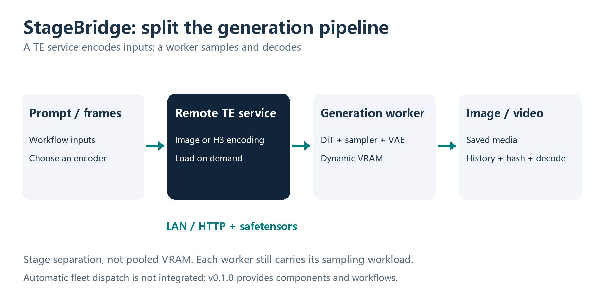
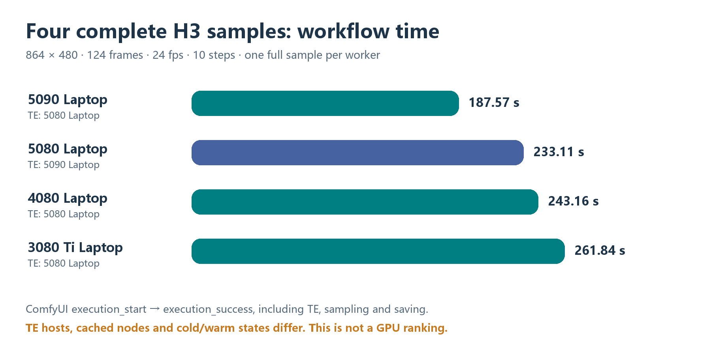

# StageBridge · 拼好卡

**Remote Encoding for ComfyUI**

**English** | [简体中文](README.zh-CN.md)

New [extended evidence and configuration guide (Chinese)](docs/EXTENDED-EVIDENCE.zh-CN.md): 60 individual Image runs with CSV, first-image timing, seeds and output hashes, two H3 pilot runs, paired latency, concurrency and recovery checks. These are verified extractions of historical receipts, not claims that every batch was rerun on the current release. [Machine-readable data](results/image-60-runs.json).

Move the text/vision encoding stage to a separate GPU host, then let a ComfyUI worker run diffusion, VAE decoding and media output. StageBridge provides an HTTP TE service, four custom nodes, example API workflows and measured results from four NVIDIA laptop GPUs.

**v0.1.0 is an experimental, runnable component release.** It is not pooled VRAM, tensor-parallel sampling or an automatic fleet scheduler. A single worker still needs sufficient GPU and system memory for its own generation stages.



## What works

- Qwen Image 2.1 text-to-image and image-edit encoding; worker-side VAE processing stays local.
- MiniMax H3 text/first/last-frame conditioning through `MiniMaxH3ImageToVideoRemote`. Actual video validation covers first-frame `fl2va`; arbitrary audio/video reference mode is not integrated.
- Lossless float32 conditioning transport in safetensors, strict shape/metadata checks and explicit checkpoint fingerprints. Mismatches return HTTP 409.
- Bounded request queues, disconnected-request cancellation, persistent per-node HTTP connections and optional bearer-token authentication.
- On-demand model loading, exclusive Image/H3 switching and configurable idle unloading. The tested deployment uses **10 minutes**. The service process remains available after model weights are released.
- Optional Image local fallback; examples disable it so a remote failure cannot silently load TE on a memory-constrained worker. H3 has no automatic local TE fallback.

## Four workers produced real H3 videos

Each row is one successful **864×480, 124-frame, 24 fps, 10-step** sample, approximately 5.17 seconds of output. All GPUs below are **Laptop GPUs**, not desktop cards.

| Video worker | VRAM | Remote TE host | ComfyUI execution time |
|---|---:|---|---:|
| RTX 5090 Laptop | 24 GiB | RTX 5080 Laptop | 187.570 s |
| RTX 5080 Laptop | 16 GiB | RTX 5090 Laptop | 233.113 s |
| RTX 4080 Laptop | 12 GiB | RTX 5080 Laptop | 243.159 s |
| RTX 3080 Ti Laptop | 16 GiB | RTX 5080 Laptop | 261.838 s |

Times come from ComfyUI `execution_start` → `execution_success`, including remote encoding, sampling and saving. **Different TE hosts, cached nodes and cold/warm states make this a workflow demonstration, not a controlled GPU ranking.** The four workers were tested sequentially; aggregate concurrent throughput was not measured. The 4080 sample had only about 1.54 GiB of free system RAM at its lowest sampled point.



### Actual output frames, not embedded videos

The montage extracts frames 0, 62 and 123 from each saved MP4. Frame selection and source-video hashes are in [montage provenance](assets/montage-provenance.json). All four source videos decoded to 124 frames. The stills show sample outputs; they do not establish perceptual equivalence between machines.


## Try it

Use an existing, compatible ComfyUI runtime with the required Qwen Image 2.1 / MiniMax H3 implementations and licensed model files. This repository does **not** include ComfyUI, CUDA kernels or model weights. See [setup and compatibility](docs/SETUP.md) before running models.

```powershell
# Run with your ComfyUI Python; these commands do not download models.
python -m pip install -r requirements-server.txt
python scripts/check_runtime.py --comfy-root C:/AI/ComfyUI_windows_portable/ComfyUI
Copy-Item config.example.yaml config.local.yaml
# Edit comfy_root and checkpoint paths; remove unused profiles.
python run_server.py --config config.local.yaml
```

The example binds to `127.0.0.1`. For a separate trusted LAN worker, explicitly bind the service to `0.0.0.0`, allow the chosen port in your environment and set the node's `server_url` to the server's LAN address. SSH tunneling is not required. Use `TE_AUTH_TOKEN` on the server and `REMOTE_TE_API_TOKEN` on workers when authentication is needed; keep tokens out of workflow JSON.

Install the nodes on each worker, then restart that worker's ComfyUI:

```powershell
python scripts/install_nodes.py --comfy-root C:/AI/ComfyUI_windows_portable/ComfyUI
```

The installer refuses to overwrite an existing node directory. Alternatively, extract the node release ZIP into `ComfyUI/custom_nodes`. Remove/disable an older `ComfyUI-RemoteTE` copy before installing the renamed `ComfyUI-StageBridge` package: duplicate class registrations are not supported.

Example files under `workflows/` are **ComfyUI API prompt graphs**, not drag-and-drop UI workflow files. Set `server_url`, verify the fingerprint returned by `/health`, select your installed models and replace `example.png` with an image uploaded to the worker. See [submission instructions](docs/SETUP.md#submit-a-workflow).

## Reproduce the recorded summaries without a GPU

```powershell
python scripts/inspect_results.py
```

To test the protocol and queue logic, install the test dependencies in a suitable Python/Torch environment, then run:

```powershell
python -m pip install -r requirements-test.txt
python -m unittest discover -s tests -v
```

Tests use mock encoders and loopback HTTP; they do not load model weights. [Recorded data](results/h3-runs.json), [numerical limits](docs/EVIDENCE.md), [packaging provenance](docs/PACKAGING.md) and [architecture](docs/ARCHITECTURE.md) explain what can and cannot be reproduced. Historical reference images, raw output tensors and full videos are not distributed, so this package is not a byte-identical reproduction kit for those historical samples.

## Important limits

- The tested runtime is a particular Windows ComfyUI build. Linux, other ComfyUI versions, other model families, high concurrency and long-video production have not been validated.
- Image HTTP results matched the same 5090 native encoder bit-for-bit in seven tested cases. This does not mean all GPUs produce identical native embeddings, or that H3 has passed the same numerical parity test.
- A historical Image cross-GPU maximum absolute difference was `0.09015`, **not a 9% error**. Its relative RMS difference was about `0.00425%`; the original `0.02` maximum-difference target was not met. See [the full interpretation](docs/EVIDENCE.md).
- Splitting TE can change memory feasibility and role placement; it does not guarantee faster single-job latency. A [separate CPU–GPU TE study](https://github.com/JingWang-Star996/cpu-te-bench) found much faster GPU TE encoding after memory-headroom tuning. Its TE-only timings are not these full-video timings.
- The current server requires CUDA. CPU-only TE and automatic worker dispatch are not integrated into this release.

Original project code and documentation are MIT-licensed. Models, ComfyUI and other dependencies retain their own licenses; see [third-party notices](THIRD_PARTY_NOTICES.md). Model names identify tested integrations and do not imply endorsement.
