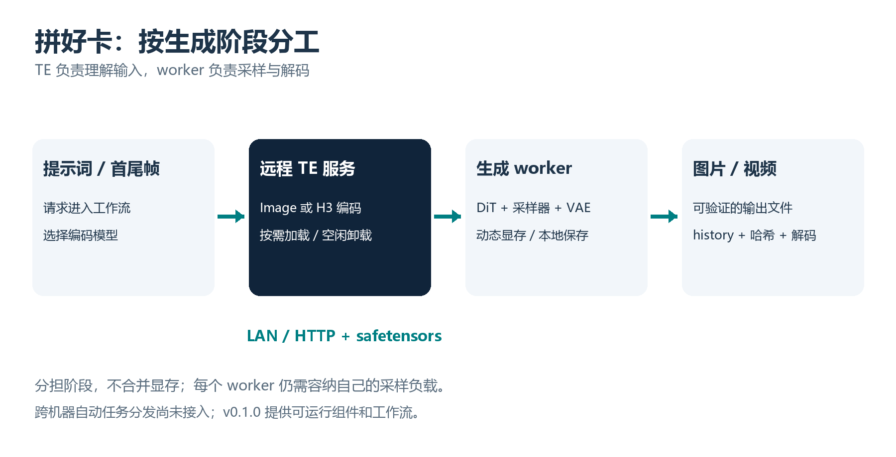
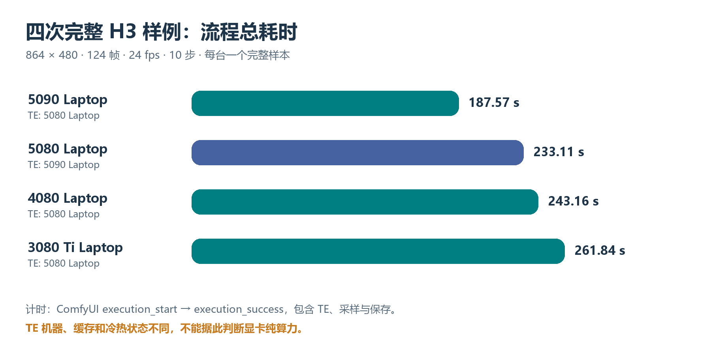
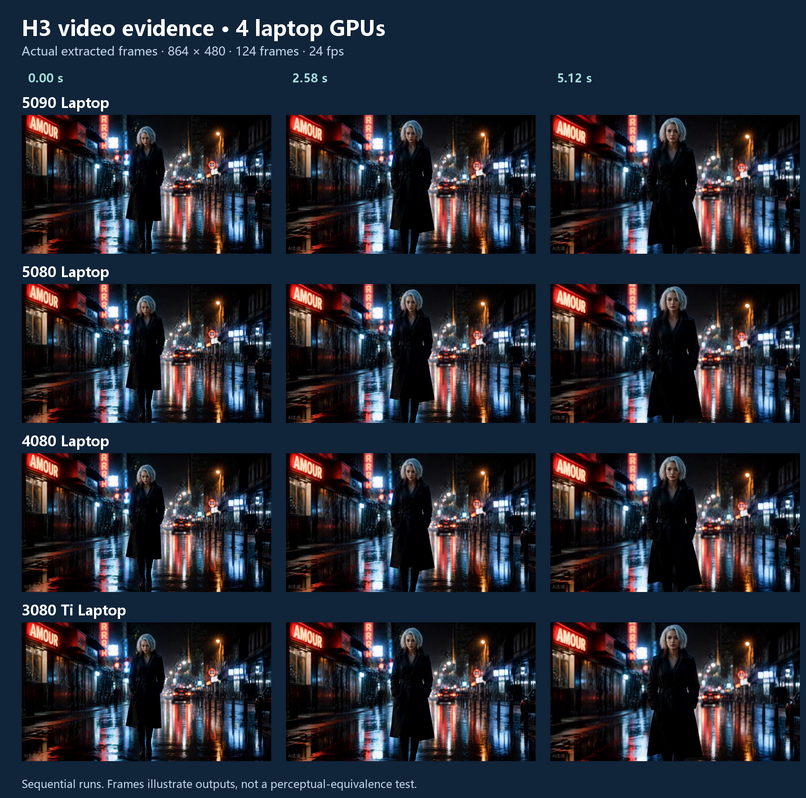
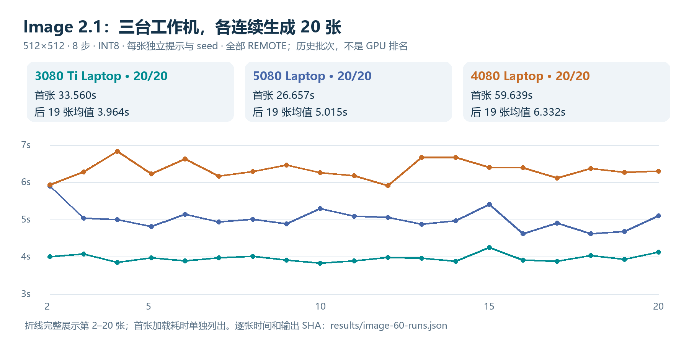
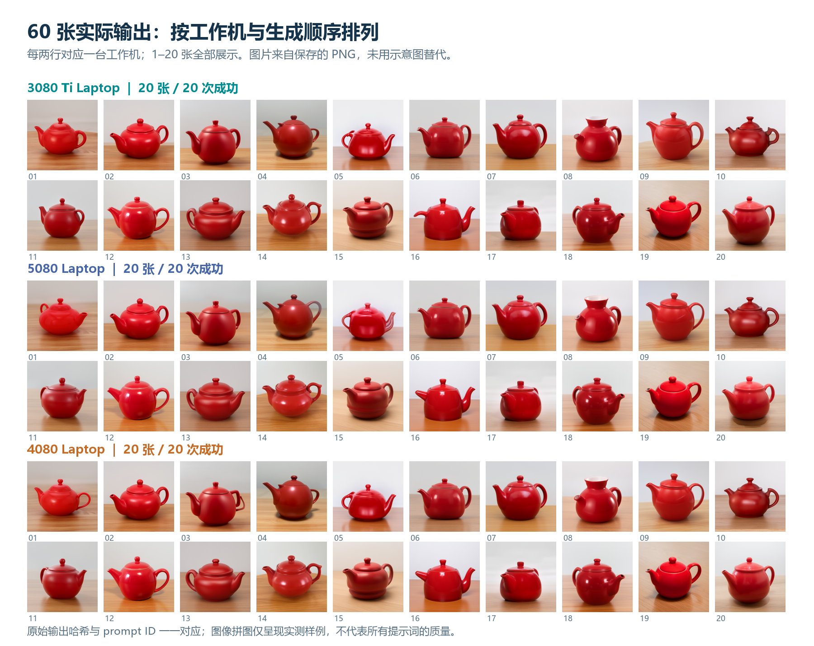
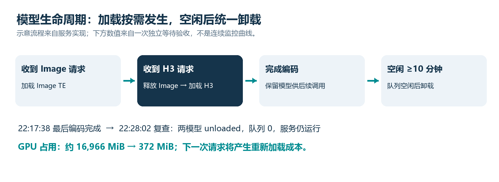

# 12G 也能跑 H3：拼好卡，把大显存的门槛打下来

大模型应用把人拦在门外的，经常不是“完全算不了”，而是几组模型和中间数据同时压在一台机器上。我们把 H3 的编码阶段拆成服务：12GB RTX 4080 Laptop 调用远端大 TE，本机完成采样和成片，用时 243.159 秒，交出约 5.17 秒带声音的视频。

这是一份基于 2026-09-28 实测的发布说明。

## 系统框架：编码借出去，生成留在自己手里

理解提示词、处理参考图、反复采样、解码成片，是不同阶段。我们把编码模型单独放到另一台机器，工作机通过网络拿回条件，继续本地生成。



编码端运行 TE 服务，负责 Image 或 H3 的文本／视觉编码。工作机运行 ComfyUI，负责生成模型、采样、VAE 和文件保存。Image 编辑所需的参考图 VAE latent 仍在工作机产生；H3 这次完整验证的是首帧 fl2va 图生视频。

中文“拼好卡”、英文 StageBridge，让已有设备按阶段分工。12G 工作机减少 TE 负担，采样仍在本机；另外需要一台能加载编码器的 GPU 宿主。显存并未合并，完整视频也未转交大卡生成。


## 实测参数：先把环境、模型和配方摊开

### 受测机器与运行时

四张卡全部为笔记本 GPU：RTX 5090 Laptop 24 GiB、5080 Laptop 16 GiB、4080 Laptop 12 GiB、3080 Ti Laptop 16 GiB。4080 这台约 24GB 系统内存。本文没有统一四机 CPU、功耗和温度条件，因此不把结果当成 GPU 算力排名。

公开的参考运行时快照来自 5090：Windows 11；Python 3.13.14；Torch 2.13.0+cu130；CUDA 13.0；comfy-kitchen 0.2.35；comfy-aimdo 0.5.5；safetensors 0.8.0；transformers 5.15.1；tokenizers 0.22.2。ComfyUI 报告版本 0.37.4，另存关键源码 SHA。快照里的 triton-windows 为 3.8.0.post28，不代表每个算子都走 Triton，也不是老显卡的通用安装建议。

### H3：这组 12G 成片结果，用的就是这些参数

输入：同一首帧；文本为 “The woman slowly lifts her gaze as rain falls on the neon-lit street. Subtle natural motion, locked camera, one continuous shot.”

分辨率 864×480；length=124；fps=24；steps=10；seed=90409231077532；sampler=res_multistep；scheduler=simple；denoise=1.0；BasicGuider 接远程 conditioning。工作流未配置 CFGGuider，不能凭空补一个 CFG 数值。CreateVideo bit_depth=8；SaveVideo 的 format/codec 为 auto。

生成模型采用 minimax_h3_fl2va_pruned_int8_convrot.safetensors，weight_dtype=default。编码模型是现有 32B 系、截断至 50 层的 NVFP4/AWQ 权重；不是本文重新训练或缩小的编码器。H3 worker 使用 DynamicVRAM，4080 与 3080 Ti 启动日志为 NORMAL_VRAM，没有启用 highvram 或禁用动态显存的参数。

远程节点 MiniMaxH3ImageToVideoRemote：model=minimax_h3；expected_fingerprint=35a88d51044231fe；timeout_s=900。视频与音频分别走对应 VAE，最终合成 MP4。原输入图未公开，已公开其 SHA 和 API 配方；读者可以换自己的图复跑方法，不能承诺逐字节重现历史成片。

[参数原件：H3 124 帧 API 图](https://github.com/JingWang-Star996/stagebridge/blob/main/workflows/h3-fl2va-124-api.json)

[环境原件：受测运行时与源码 SHA](https://github.com/JingWang-Star996/stagebridge/blob/main/provenance/validated-runtime.json)


## 实测结果一：四台工作机，四次完整 H3 成片



5090 24G → 5080 TE：187.570 秒；TE 节点报告 70.228 秒。5080 16G → 5090 TE：233.113 秒；TE 报告 49.685 秒，其中冷加载约 47.362 秒。

4080 12G → 5080 TE：243.159 秒；TE 报告 64.801 秒。3080 Ti 16G → 5080 TE：261.838 秒；TE 报告 68.243 秒。TE 报告不是完整 HTTP 往返时间，不应简单相减当成纯 GPU 采样时间。

4080 和 3080 Ti 先跑过 39 帧小样，再跑完整样例，加载等节点命中缓存；5090 与 5080 完整样例没有已缓存节点。四次顺序执行，编码宿主、冷启动与后台状态不统一。这些数据证明各配置完成任务，不能证明四卡同时生成，也不能归因出“服务化提速几倍”。

### 小样、内存余量也一起交代

608×352、39 帧、10 步小样：3080 Ti 的 ComfyUI 执行 84.079 秒，4080 为 104.110 秒。驱动脚本记录分别为 90.508 和 111.404 秒，含外部提交／轮询等待，不能混到主表口径中。两个 MP4 均解码出 39 帧。

完整样例采样最低空闲系统内存：4080 1.541 GiB、3080 Ti 19.245 GiB、5080 27.830 GiB；对应最低空闲显存约 0.296／0.277／0.291 GiB。约每 10 秒采样一次，不是连续峰值。尤其 4080 的内存余量很小：这次成功，不等于可直接增加并发和视频长度。

[逐次记录：时间、缓存节点、prompt ID、资源与输出哈希](https://github.com/JingWang-Star996/stagebridge/blob/main/results/h3-runs.json)

[小样记录：39 帧结果与两种计时口径](https://github.com/JingWang-Star996/stagebridge/blob/main/results/h3-minimal-runs.json)


## 实测结果二：把视频证据放到文章里

下面每行来自一台工作机的真实 MP4，取第 0、62、123 帧。四段文件都重新解码出 124 帧：H.264、864×480、24fps，并含 32kHz 双声道 AAC。输出哈希与各次执行记录绑定，媒体不是为文章另画的示意图。



4080 成片为 642,041 字节；音频 RMS 0.009466，非静音；首末帧平均像素绝对差 29.836。对应 prompt ID：214a128b-9d27-4eca-b287-d5ede156b20b。MP4 SHA-256 前 16 位为 90e47a609521b758，完整 64 位哈希在结果 JSON。

[抽帧来源：源文件哈希与取帧位置](https://github.com/JingWang-Star996/stagebridge/blob/main/assets/montage-provenance.json)


## 实测结果三：Image 2.1 连续 60 张，不只跑一次

三台生成工作机各做过 20 次真实 Image 任务，共 60/60 成功。每次独立 prompt ID、不同提示词变体和 seed；核对提交图与 history，确认 REMOTE、关闭 fallback，并验证 512×512 PNG。它们是早期常驻配置的历史批次，不冒充后续每个版本都重跑了 60 张。



3080 Ti：20/20；首张 33.560 秒；后 19 张均值 3.964 秒，范围 3.826–4.247 秒，变异系数 2.54%；worker 显存采样峰值 8,410 MiB。

5080：20/20；首张 26.657 秒；后 19 张均值 5.015 秒，范围 4.614–5.896 秒，变异系数 5.73%；显存采样峰值 8,466 MiB。

4080：20/20；首张 59.639 秒；后 19 张均值 6.332 秒，范围 5.909–6.834 秒，变异系数 3.72%；显存采样峰值 8,386 MiB，低于该卡报告的 12,282 MiB 总量。

3080 Ti worker 使用 5090 TE；4080 与 5080 两批并行共享 3080 Ti TE。因此 4080 比 3080 Ti 的数字更慢，不足以说明其显卡算力更弱。此处使用 Image 专门的 highvram 常驻设置，H3 用动态卸载，两套参数不能互抄。

[逐张数据：image-60-runs.json（也提供 CSV）](https://github.com/JingWang-Star996/stagebridge/blob/main/results/image-60-runs.json)


## Image 配方与真实输出：照参数看，不靠口号猜

Image 的共同配方：qwen_image_2.1_int8_convrot.safetensors；VAE=qwen_image_2.1_vae_bf16.safetensors；TE=qwen3vl_8b_int8_convrot.safetensors；512×512；8 步；CFG=1.0；euler／simple；denoise=1.0；每批 seed=2000–2019；负提示词为空；fallback_local=false；指纹 8bfd0f6e12abf2d2。

基础提示词为 “A red ceramic teapot on a wooden table, soft daylight, studio photograph.”，每张附带独立验收变体标记。完整文本与 seed 留在逐张 JSON，三个批次的首张 API 图也已整理。下面把全部 60 张按顺序列出。



Comfy 模型管理日志显示，三批 Image 的 DiT／VAE 全量装载，未观察到 Comfy 卸载或部分加载；这不等于抓到了 WDDM 驱动分页事件，不能宣称操作系统绝对零分页。另一次 H3 节点升级后的 Image 冷态回归，3080 Ti／4080 分别用时 38.289／68.681 秒，均远程出图成功；这两次不混入上面的暖态均值。

[可改写的 Image 实测 API 图与其他工作流](https://github.com/JingWang-Star996/stagebridge/tree/main/workflows)


## 实测结果四：延迟、并发、故障与误差都摊开

### 服务化多花多少时间？先看配对实验

5090 worker、3080 Ti TE，双方预热；512px／8 步、INT8、seed=42，三个不同短提示词交替跑本地／远程。三对时间分别为 1.632→3.110 秒、2.769→1.990 秒、1.527→2.154 秒；远程增量 +1.478、−0.779、+0.627 秒，平均 +0.442 秒。只有三对样本，不能据此保证每次只慢半秒。

LAN 直连 L1016 长文本，预热后五次完整请求为 1.290482／1.058410／1.042146／1.050802／1.051121 秒。原“每次 ≤1.2 秒”目标为 4/5 达标。另一组每次空闲 15 秒、关闭维护的样本为 2.046538／1.203041／2.178034 秒。慢样本全部保留；后来的 3 秒应用观察线也不是延迟 SLA。

### 接错请求、断服务、换权重，怎么验收

三台真实客户端同时请求 TE：每个并发返回都与自己的串行基线逐比特一致，实际起始偏差约 2.976ms；队列等待 0.32／860.04／469.09ms。这证明被测并发编码的请求绑定与排队有效，不是三段或四段 H3 同时生成的测试。

真实停服后，开启 Image 回退的任务成功出图并报告 FALLBACK；恢复服务后又报告 REMOTE。真实切换到另一份有效 W4A8 权重，新指纹 f560a1c8c2646935；客户端继续提交旧指纹得到 HTTP409，即使 fallback=True 也产生 VersionMismatch、零输出图。权重恢复后原指纹重新编码成功。

### 零传输误差，与跨卡数值差异分别记录

同一 5090 的 5 个文生图、2 个编辑编码样例：原生与 HTTP 返回 max_abs_diff=0，逐比特相等，extras 一致。跨 5090／3080 Ti 的长文本原生编码最大差为 0.0901489；3,149,824 个数里，38 个差值 ≥0.02，平均绝对差 0.00018638，相对 RMS 约 0.00425%。旧最大差门槛未过，0.09015 不是 9% 画质损失。

三组短提示词配对图平均像素通道差约 2.745／1.985／1.141（0–255 标度）；另一次茶壶改色编辑为 0.328／255。它们不是逐像素相等，也不能证明极端长提示词无可见影响。H3 本期只有功能成片验收，尚无同等级原生／HTTP 张量对照。

[配对、并发、故障与长请求数值](https://github.com/JingWang-Star996/stagebridge/blob/main/results/image-operational-checks.json)

[同卡编码与跨卡差异的公开证据](https://github.com/JingWang-Star996/stagebridge/blob/main/docs/EVIDENCE.md)


## 配置说明：模型分开放，服务参数完整公开

以下是部署说明，不是让所有人照抄某台机器的路径。服务端使用对应 ComfyUI 的 Python，先检查宿主具备 qwen_image21、nodes_minimax_h3、量化加载器和 CUDA 内核。模型权重按各自许可证另行取得，项目不捆绑下载。

### 模型清单与放置位置

编码端 Image TE：qwen3vl_8b_int8_convrot.safetensors，9,350,798,360 字节，指纹 8bfd0f6e12abf2d2。H3 TE：qwen3vl_32b_minimax_h3_nvfp4_awq.safetensors，指纹 35a88d51044231fe。

H3 工作机 DiT：minimax_h3_fl2va_pruned_int8_convrot.safetensors，20,970,379,616 字节；video VAE：minimax_h3_video_vae_fp16.safetensors，5,207,808,496 字节；audio VAE：minimax_h3_audio_vae_fp32.safetensors，605,254,808 字节。文件大小不是所需显存；完整 SHA-256 清单见 SETUP。

### config.local.yaml：可改路径的完整例子

```yaml
host: 0.0.0.0
port: 8765
comfy_root: 'C:/AI/ComfyUI'
profiles:
  qwen3vl_8b:
    ckpt_path: 'C:/Models/qwen3vl_8b_int8_convrot.safetensors'
  minimax_h3:
    ckpt_path: 'C:/Models/qwen3vl_32b_minimax_h3_nvfp4_awq.safetensors'
queue_depth: 16
queue_wait_timeout_s: 60
exclusive_profiles: true
idle_unload_min: 10
maintenance_interval_s: 0
auth_token: null
```

改成自己的绝对路径；未安装的 profile 删除。exclusive_profiles=true 表示两类编码器互斥驻留，空闲 10 分钟卸载，maintenance_interval_s=0 不做保温计算。服务当前加载前检查 Image 至少 10 GiB、H3 至少 14 GiB 空闲显存；这是实现门槛，不是总显存需求保证。

0.0.0.0 用于可信局域网监听；节点填写编码机 LAN 地址，按实际网络放行端口。同网段无需 SSH 隧道。需要认证时分别设 TE_AUTH_TOKEN／REMOTE_TE_API_TOKEN；不把令牌写入工作流或 Git，跨公网另用可信加密通路。

[配置原件与完整安装说明](https://github.com/JingWang-Star996/stagebridge/blob/main/docs/SETUP.md)


## GitHub README 收藏页：安装、提交与排错

### 编码端：在下载的仓库目录执行

```powershell
python -m pip install -r requirements-server.txt
python scripts/check_runtime.py --comfy-root C:/AI/ComfyUI
Copy-Item config.example.yaml config.local.yaml
# Edit config.local.yaml before starting.
python run_server.py --config config.local.yaml
```

python 替换成兼容 ComfyUI 的解释器；便携版通常为 python_embeded/python.exe。启动前编辑配置。不要只为启动本项目盲目升级宿主 Torch。check_runtime 是源码存在性检查，不是一次 GPU 模型运行验收。

### 工作机：安装节点，修改 API 工作流

```powershell
python scripts/install_nodes.py --comfy-root C:/AI/ComfyUI
```

重启对应 ComfyUI。安装器拒绝覆盖已有节点；更新前备份并处理旧 ComfyUI-RemoteTE，避免重复注册。填写节点 server_url、model、expected_fingerprint；H3 输入图先上传到工作机，再改 LoadImage.image。Image 样例先关闭 fallback_local，避免失败后在小卡加载 TE。

可用节点包括 QwenImage21Remote、TextEncodeQwenImage21Remote、TextEncodeQwenImageEditRemote、MiniMaxH3ImageToVideoRemote。默认地址可由 REMOTE_TE_SERVER_URL 设置；H3 可用 REMOTE_TE_H3_SERVER_URL 单独覆盖，工作流显式值优先。

```powershell
$graph = Get-Content workflows/h3-fl2va-39-api.json -Raw | ConvertFrom-Json
$body = @{prompt=$graph; client_id='stagebridge-manual'} | ConvertTo-Json -Depth 100
$reply = Invoke-RestMethod -Method Post http://127.0.0.1:8188/prompt `
  -ContentType application/json -Body $body
$reply.prompt_id
```

上段在已有 ComfyUI 监听的工作机执行，先改好图里的服务地址、模型和输入。仓库 JSON 是 API 请求图，不是拖入界面的工作流。先跑 39 帧小样，确认 /history/<prompt_id> 成功、REMOTE H3 回执及实际 MP4，再上 124 帧。

连不上：查服务监听、地址、网络与防火墙；127.0.0.1 指当前机器。409：核对权重指纹，不要绕过检查。超时：先查 history、队列和冷加载，别重复提交已经接收的任务。OOM：区分 TE 端与生成端，查后台占用、RAM 与动态卸载；Image 的 highvram 连跑设置不等于 H3 的正确设置。

[项目与中英 README：JingWang-Star996 / stagebridge](https://github.com/JingWang-Star996/stagebridge)

[发布包 v0.1.0；扩展实测数据见 main/results](https://github.com/JingWang-Star996/stagebridge/releases/tag/v0.1.0)


## 原理解析：为什么分阶段能降低生成端门槛

### 显存压力被重新分配，计算并没有消失

TE 先把文字／参考图变成条件，采样器再反复使用这些条件。跨机发送的是输入和编码结果，不必在每个去噪步骤同步整套模型权重。把 TE 移走，生成端减少一组模型的驻留与切换负担；DiT 的动态显存管理仍要借助系统内存搬运权重。这正是 12G 实测必须同时交代 INT8、DynamicVRAM 和 RAM 的原因。

因此受益最大的，是已有另一台兼容设备、希望生成端减负的用户。如果只有一台机器，或另一台也装不下 TE，就不能直接套用标题；如果网络很慢、频繁切模型，额外等待可能抵消收益。本文没有同配置 H3 全原生基线，不给服务化凭空标注加速倍数。

### 把“能传过去”变成“可检查的服务”

服务用 safetensors 无损传输 float32 条件，验证 shape、附加字段与模型指纹。队列有界，编码／加载／卸载共享串行锁，客户端断开会处理等待取消；节点内复用连接，不对状态不明的 POST 盲目重发。指纹是避免模型版本串用的机制，同卡逐比特测试才是被测传输零误差的证据。



一次观察中，22:17:38 最后编码完成；22:28:02 服务仍运行、队列 0、两种模型都 unloaded，GPU 占用约 16,966→372 MiB。下一次重新加载会有冷启动成本。所谓动态使用，就是有调用才加载、空闲后释放，而非把所有服务和模型永远挂在显卡上。

第一期交付到这里：H3 四机完整成片，Image 的 60 张历史连跑，配对、并发和故障记录，配置与证据一起公开。86 项发布测试属于协议／客户端等 mock 测试，不拿来冒充 GPU 出片次数。第二期的远端 RTX2060 6GB 另行挑战，未验收前不算成果。自动派单、长期高并发、长视频与其他系统仍需要继续验证。

[原理与证据总入口：扩展实测说明](https://github.com/JingWang-Star996/stagebridge/blob/main/docs/EXTENDED-EVIDENCE.zh-CN.md)

## 证据文件与复核范围

[逐张 CSV](../results/image-60-runs.csv) · [来源回执哈希](../results/extended-evidence-sources.json) · [真实拼图来源](../assets/image-60-contact-sheet.sources.json)

这次重新整理历史材料，逐张核对了60份执行 history 的时间、REMOTE回执、关闭fallback配置及保存PNG的SHA和解码尺寸。`python scripts/inspect_extended_results.py` 可从公开JSON重算均值、范围、标准差，检查60个唯一prompt ID与拼图哈希映射。该脚本不运行模型，不证明未公开原件的真实性。

原始完整history、所有PNG、参考输入和视频没有全部上传；数据为作者自测记录，不是第三方认证。私有地址、账户、机器标识和凭据没有发布。v0.1.0历史发布包不变，新增资料在main的docs/results/assets；已存在的配置和API图仍可按文档替换自己的输入复测。
